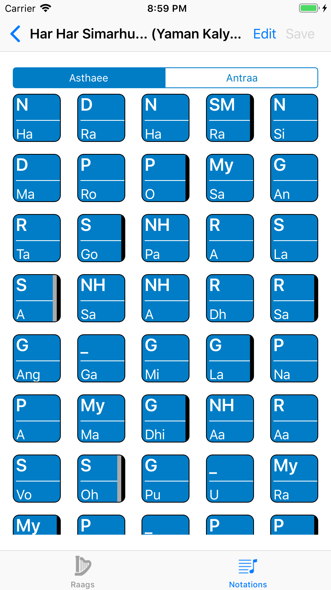
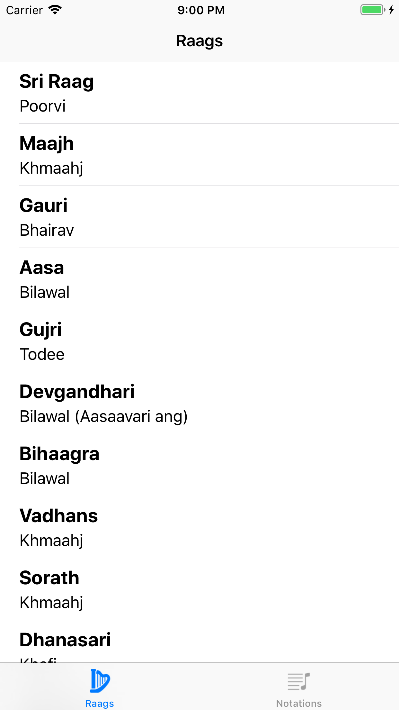

# RaagNotes
iOS Swift app to reference the musical notation for Indian Classical raags found in the Sikh scripture

Raag Notes lets you learn the Raags of Siri Guru Granth Sahib Ji by providing their notations.

- Reference the notations for all 31 shudh raags of Siri Guru Granth Sahib Ji (complete set of raags coming soon)

- Take down the notations of a bandish for your own shabads (coming soon)

- Hear keertan recordings of the raag and the aroh, avroh and pakardh (coming soon)
