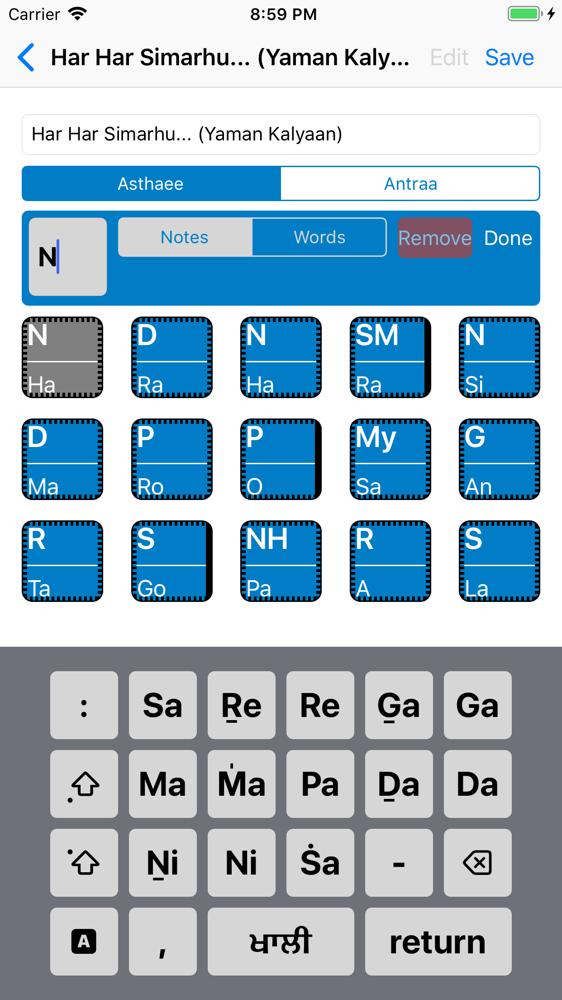

# RaagNotes
iOS Swift app to reference and create musical notation sets for Indian classical raags (ragas) found in Siri Guru Granth Sahib Ji (the Sikh scriptural authority)

Raag Notes lets you learn the Raags of Siri Guru Granth Sahib Ji by providing their notations.

- Reference the notations for all 31 shudh raags of Siri Guru Granth Sahib Ji (complete set of raags coming soon)

- Take down the notations of a bandish (composition) for your own shabads 

- Hear keertan recordings of the raag and the aroh, avroh and pakardh (coming soon)
